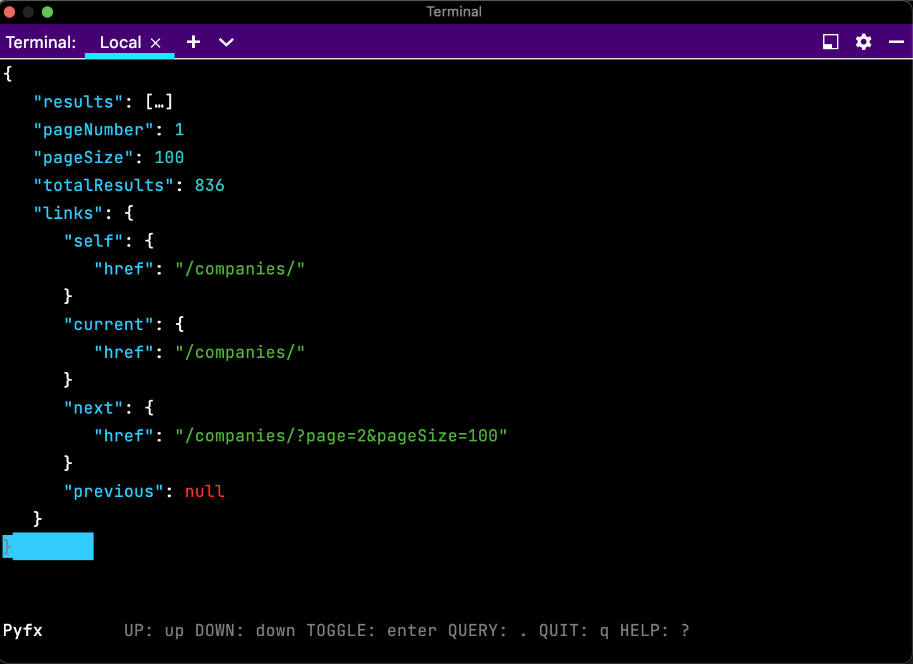

# CLIdat

CLIdat is a tool for inspecting Data from Codat.

The Command Line Interface itself is written with [Click](https://github.com/pallets/click),
whilst the output of the different commands is passed to
a TUI from the [Pyfx](https://github.com/cielong/pyfx) package.

## Installation

```console
pip install clidat
```
## Quick Start

```console
user@host:~$ clidat auth
Your Codat API Key:

user@host:~$ clidat get-companies
```



## Docs

To see a list of all avaliable commands run:
```console
user@host:~$ run clidat --help

  auth
  get-account
  get-account-transaction
  get-account-transactions
  ...

```
To get details on a particular command, just append the --help 
flag  onto the end of the command, for example: 

```console
user@host:~$ clidat get-payment --help
Options:
  --payment TEXT          [required]
  -id, --company-id TEXT  [required]
  --help                  Show this message and exit.


```

