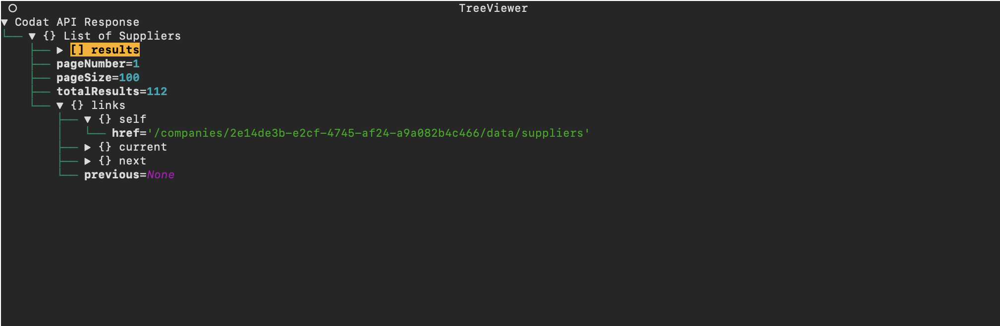

# CLIdat

CLIdat is a tool for inspecting Data from Codat.

The Command Line Interface itself is written with [Click](https://github.com/pallets/click),
whilst the output of the different commands is passed to
a TUI from the [Textual](https://github.com/Textualize/textual) package.

I work in support at Codat, and have built this tool as a personal project
to help with my day-job. This isn't an officially 
supported product.

## Installation

CLIdat is distributed via the Python Package Index (PyPI). We reccomend installing
it inside a [virtual environment](https://docs.python.org/3/library/venv.html)

```console
(venv) user@host:~$ pip install clidat
```
Thanks to Textual, this software is cross-platform and
should work well on Windows, Linux and MacOS. 

## Quick Start

```console
(venv) user@host:~$ clidat auth
Your Codat API Key:

(venv) user@host:~$ clidat get-suppliers -id 2e14de3b-e2cf-4745-af24-a9a082b4c466
```



## Docs

To see a list of all avaliable commands run:
```console
(venv) user@host:~$ run clidat --help

  auth
  get-account
  get-account-transaction
  get-account-transactions
  ...

```
To get details on a particular command, just append the --help 
flag  onto the end of the command, for example: 

```console
(venv) user@host:~$ clidat get-payment --help
Options:
  --payment TEXT          [required]
  -id, --company-id TEXT  [required]
  -j, --json              View plain JSON response
  --help                  Show this message and exit.


```

